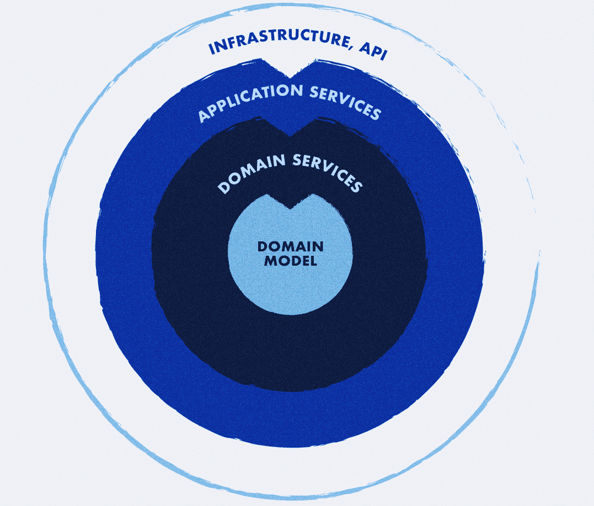

# DemoDomainDrivenDesign

## Architecture
Onion Architecture based on the DDD model, we’ve created onion architecture (aka hexagonal or clean architecture).

The idea of the Onion Architecture is based on the inversion of control principle, i.e. placing the domain and services layers at the center of your application, externalizing the infrastructure.



## Rules

- Domain - contain only abstraction
- Application - communication between the domain part and the infrastructure part
- Infrastructure - implementation of communication with the infrastructure part

## Requirements
> Docker

## Installation

```bash
go get -u -v all
docker compose up -d
```

## Using

Build project
```bash
go build ./main.go
```

Run project
```bash
./main
```
or
```bash
go run ./main.go
```